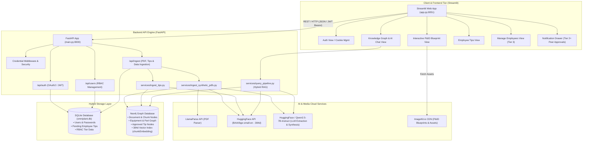
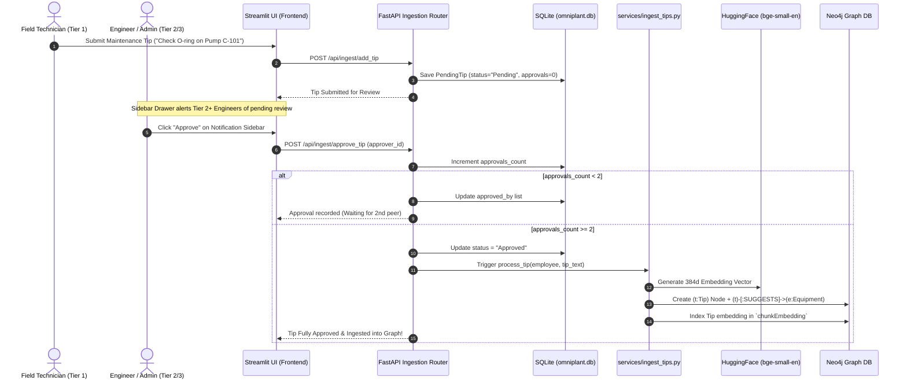
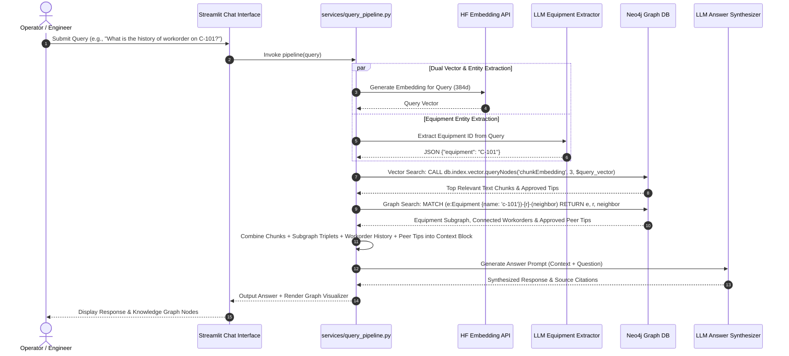
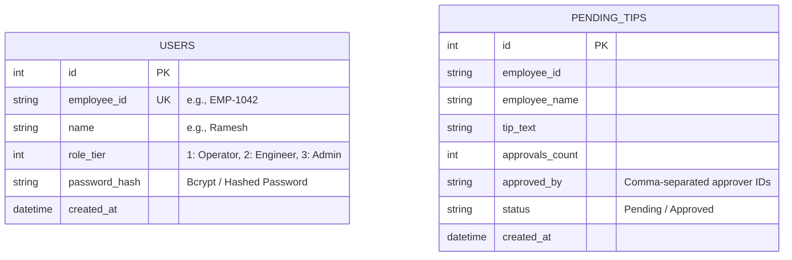
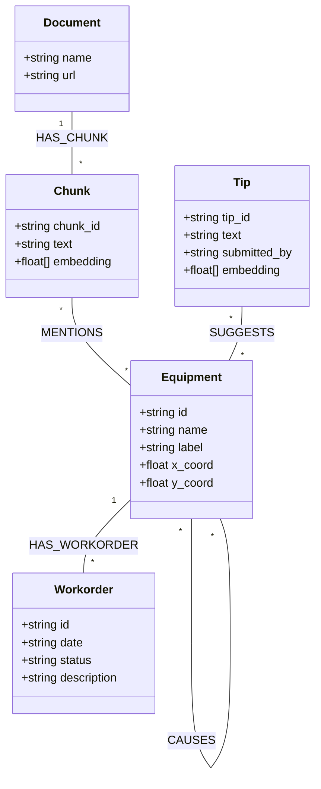
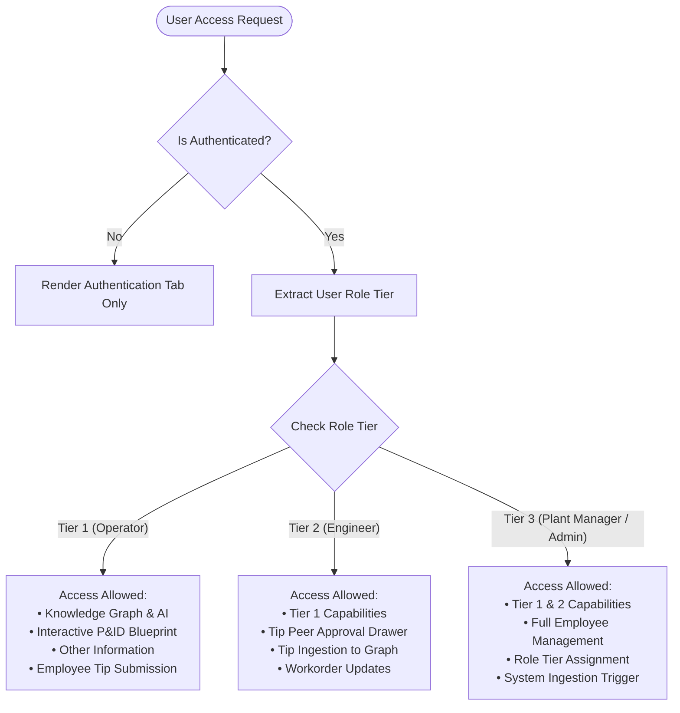

# OmniPlant.AI — System Architecture & Diagram Specification

Welcome to the architectural reference document for **OmniPlant.AI**. This document provides a complete technical breakdown, database schemas, component interactions, data flow sequences, and renderable **Mermaid.js** architectural diagrams to guide engineers, architects, and technical designers.

---

## 1. High-Level System Architecture

OmniPlant.AI is built on a **decoupled, modular architecture** integrating a Streamlit frontend with a FastAPI backend engine, a hybrid storage layer (SQLite relational DB + Neo4j Graph & Vector DB), external cloud services (ImageKit CDN, LlamaParse, HuggingFace Inference API), and LLM reasoning models.



---

## 2. Component Details & Tech Stack

| Layer / Component | Technology Stack | Key Responsibilities |
| :--- | :--- | :--- |
| **Frontend UI** | Python, Streamlit, `streamlit_cookies_controller` | Renders user dashboards, P&ID visualizer, AI chat, employee tips, peer notification sidebar, RBAC tabs. |
| **Backend API Engine** | Python, FastAPI, Uvicorn, SQLAlchemy, Pydantic | Provides RESTful endpoints, handles JWT auth, background processing, peer tip approval handling. |
| **Relational Database** | SQLite (`omniplant.db`), SQLAlchemy ORM | Stores employee accounts, hashed credentials, pending tips (`PendingTip`), roles, and admin data. |
| **Graph & Vector Database**| Neo4j, Cypher, Neo4j Python Driver | Stores equipment knowledge graph nodes, relationships, text chunks, approved tips, and 384-d vector embeddings. |
| **Document Parser** | LlamaParse API | Converts complex PDF manuals and engineering documents into structured text/markdown chunks. |
| **Embedding Engine** | HuggingFace Inference API (`BAAI/bge-small-en`) | Generates dense 384-dimensional vector embeddings for chunk/tip indexes and query matching. |
| **LLM Reasoning Engine** | HuggingFace / `Qwen/Qwen2.5-7B-Instruct` | Extracts equipment graph entities/triplets and synthesizes diagnostic answers. |
| **Media CDN** | ImageKit.io | Hosts high-resolution P&ID blueprint image assets and equipment diagrams. |

---

## 3. Peer Maintenance Tip Approval & Ingestion Sequence



---

## 4. Hybrid RAG & Graph Retrieval Pipeline Sequence

When a user asks a maintenance or operational question, OmniPlant.AI combines dense vector similarity search across documents and approved tips with graph traversal to deliver context-aware answers.



---

## 5. Entity-Relationship & Graph Database Schema

OmniPlant.AI utilizes a dual storage schema: **Relational Tables** for authentication, pending tips, and user roles, and a **Property Graph Schema** for knowledge graphs.

### A. Relational Database Schema (SQLite `omniplant.db`)



### B. Graph Database Schema (Neo4j)



---

## 6. Security, Authentication & Role-Based Access Control (RBAC)

OmniPlant.AI enforces strict Role-Based Access Control across three operational tiers. Authentication is managed via JWT OAuth2 bearer tokens, persisted locally using HTTP-only/Browser cookies.



---

## 7. Guidelines for Rendering Architectural Diagrams

- **Mermaid.js**: Copy any of the ```mermaid code blocks in this document into [Mermaid Live Editor](https://mermaid.live) or render directly in GitHub/VSCode.
- **Draw.io / Lucidchart**: Import the Mermaid syntax directly via *Insert > Advanced > Mermaid*.

---
*Document Version: 1.1.0 | System Name: OmniPlant.AI Production Engine*
