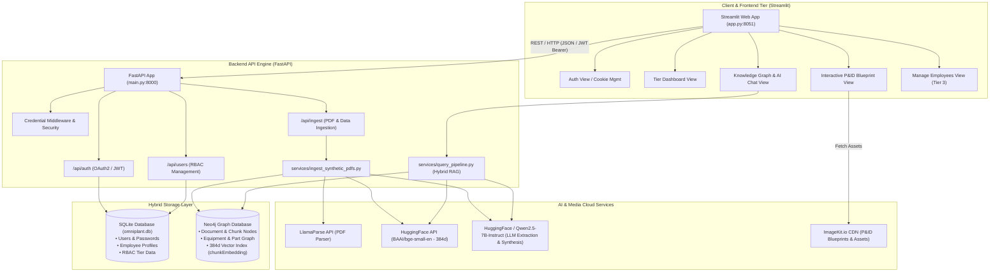
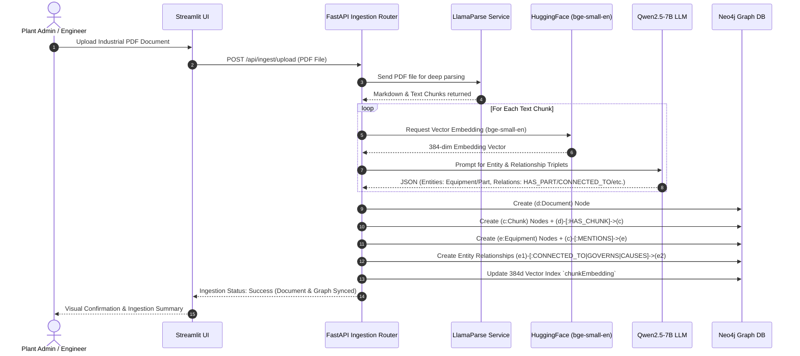
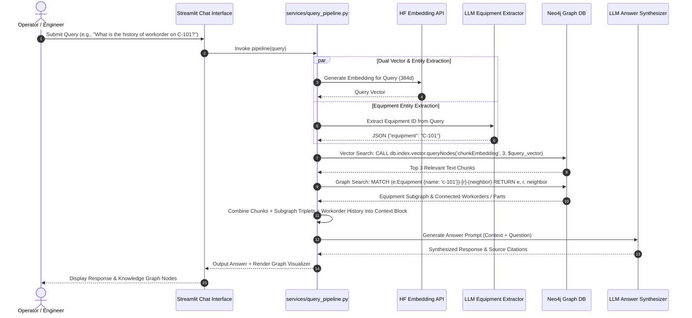
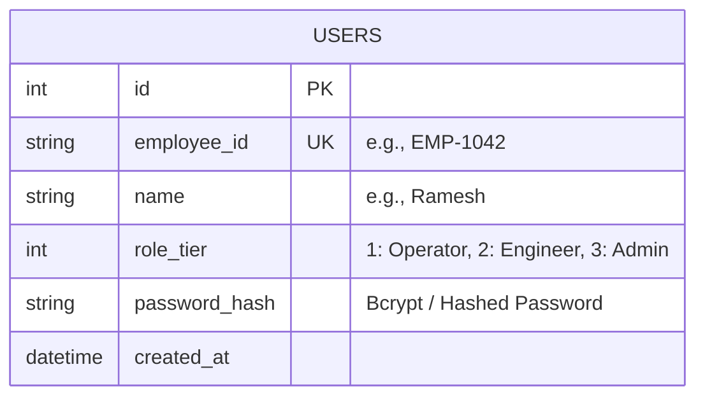
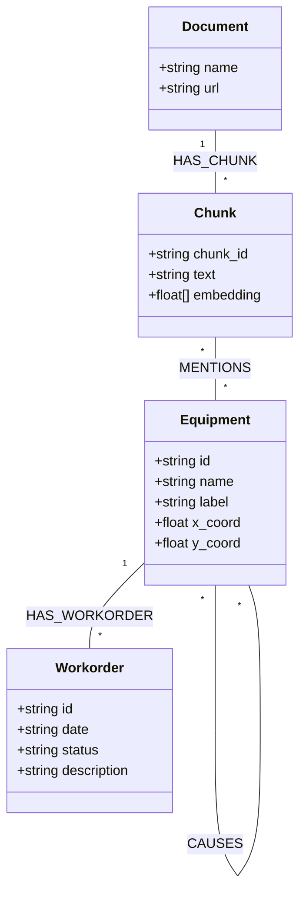
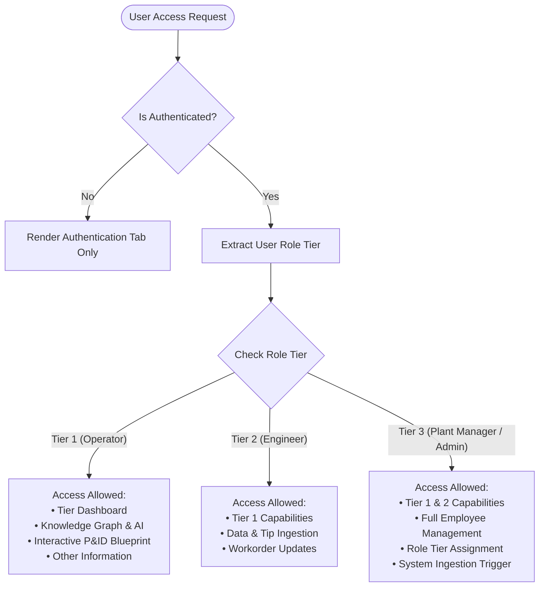
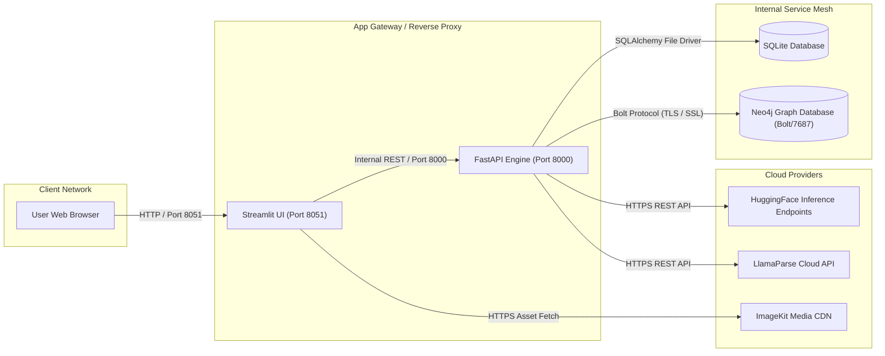

# OmniPlant.AI — System Architecture & Diagram Specification

Welcome to the architectural reference document for **OmniPlant.AI**. This document provides a complete technical breakdown, database schemas, component interactions, data flow sequences, and renderable **Mermaid.js** architectural diagrams to guide engineers, architects, and technical designers.

---

## 1. High-Level System Architecture

OmniPlant.AI is built on a **decoupled, modular architecture** integrating a Streamlit frontend with a FastAPI backend engine, a hybrid storage layer (SQLite relational DB + Neo4j Graph & Vector DB), external cloud services (ImageKit CDN, LlamaParse, HuggingFace Inference API), and LLM reasoning models.



---

## 2. Component Details & Tech Stack

| Layer / Component | Technology Stack | Key Responsibilities |
| :--- | :--- | :--- |
| **Frontend UI** | Python, Streamlit, `streamlit_cookies_controller` | Renders user dashboards, P&ID visualizer, AI chat, session cookies, RBAC tabs. |
| **Backend API Engine** | Python, FastAPI, Uvicorn, SQLAlchemy, Pydantic | Provides RESTful endpoints, handles JWT auth, background processing, lifespan lifecycle. |
| **Relational Database** | SQLite (`omniplant.db`), SQLAlchemy ORM | Stores employee accounts, hashed credentials, roles, and administrative data. |
| **Graph & Vector Database**| Neo4j, Cypher, Neo4j Python Driver | Stores equipment knowledge graph nodes, relationships, text chunks, and 384-d vector embeddings. |
| **Document Parser** | LlamaParse API | Converts complex PDF manuals and engineering documents into structured text/markdown chunks. |
| **Embedding Engine** | HuggingFace Inference API (`BAAI/bge-small-en`) | Generates dense 384-dimensional vector embeddings for chunk index and query matching. |
| **LLM Reasoning Engine** | HuggingFace / `Qwen/Qwen2.5-7B-Instruct` | Extracts equipment graph entities/triplets and synthesizes diagnostic answers. |
| **Media CDN** | ImageKit.io | Hosts high-resolution P&ID blueprint image assets and equipment diagrams. |

---

## 3. Data Ingestion Pipeline Sequence

The document ingestion pipeline processes engineering manuals and industrial documentation, converting them into structured knowledge graph nodes and vector embeddings.



---

## 4. Hybrid RAG & Graph Retrieval Pipeline Sequence

When a user asks a maintenance or operational question, OmniPlant.AI combines dense vector similarity search with graph traversal to deliver context-aware answers.



---

## 5. Entity-Relationship & Graph Database Schema

OmniPlant.AI utilizes a dual storage schema: **Relational Tables** for authentication/users, and a **Property Graph Schema** for knowledge graphs.

### A. Relational Database Schema (SQLite `omniplant.db`)



### B. Graph Database Schema (Neo4j)



#### Supported Graph Relationship Types:
- `HAS_CHUNK`: Links a Document to its constituent text chunks.
- `MENTIONS`: Connects a text chunk to specific industrial equipment entities.
- `CONNECTED_TO`: Connects two equipment components physically or logically.
- `HAS_PART`: Hierarchical relationship between assembly and subcomponents.
- `GOVERNS`: Control relationships (e.g., control valve governing flow to a pump).
- `LOCATED_IN`: Spatial placement (e.g., Equipment located in Zone B).
- `MONITORS`: Sensor measurement (e.g., pressure sensor monitoring a boiler).
- `REQUIRES`: Operational prerequisite.
- `CAUSES`: Diagnostic fault relationship (e.g., bearing failure causes vibration).
- `INDICATES`: Telemetry indicator relationship.

---

## 6. Security, Authentication & Role-Based Access Control (RBAC)

OmniPlant.AI enforces strict Role-Based Access Control across three operational tiers. Authentication is managed via JWT OAuth2 bearer tokens, persisted locally using HTTP-only/Browser cookies.



### RBAC Tier Matrix

| Feature / Action | Tier 1 (Operator) | Tier 2 (Engineer) | Tier 3 (Plant Manager / Admin) |
| :--- | :---: | :---: | :---: |
| View P&ID Interactive Blueprint | ✅ | ✅ | ✅ |
| Query Knowledge Graph & AI Assistant | ✅ | ✅ | ✅ |
| View Equipment Technical Documentation | ✅ | ✅ | ✅ |
| Submit Maintenance Tips & Workorders | ❌ | ✅ | ✅ |
| Trigger Manual PDF Document Ingestion | ❌ | ❌ | ✅ |
| Register New Employees / Users | ❌ | ❌ | ✅ |
| Modify User Roles & Permissions | ❌ | ❌ | ✅ |

---

## 7. Deployment & Network Topology



---

## 8. Guidelines for Rendering Architectural Diagrams

When exporting or creating visual diagrams for presentations, documentation, or software design reviews, adhere to the following conventions:

1. **Colors & Themes**:
   - **Frontend (Streamlit)**: Primary Accent `#FF4B4B` / Dark Background `#0E1117`.
   - **Backend (FastAPI)**: Teal `#009688` / Dark Slate `#1A202C`.
   - **Graph Database (Neo4j)**: Neo4j Blue `#008CC1` / Node Accents `#4C9AFF`.
   - **Relational DB (SQLite)**: Emerald Green `#2ECC71`.
   - **AI / Cloud Services**: Purple `#8E44AD`.

2. **Diagram Tool Compatibility**:
   - **Mermaid.js**: Copy any of the ```mermaid code blocks in this document into [Mermaid Live Editor](https://mermaid.live) or render directly in GitHub/VSCode.
   - **Draw.io / Lucidchart**: Import the Mermaid syntax directly via *Insert > Advanced > Mermaid*.
   - **PlantUML**: The component and ER breakdown can be converted using standard PlantUML class and sequence structures.

---
*Document Version: 1.0.0 | System Name: OmniPlant.AI Production Engine*
